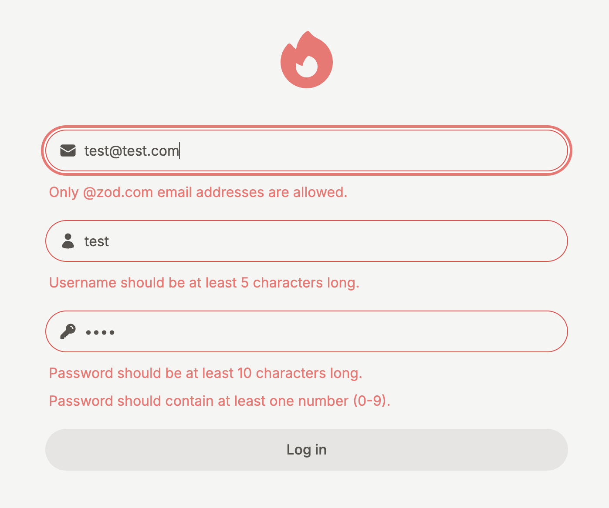
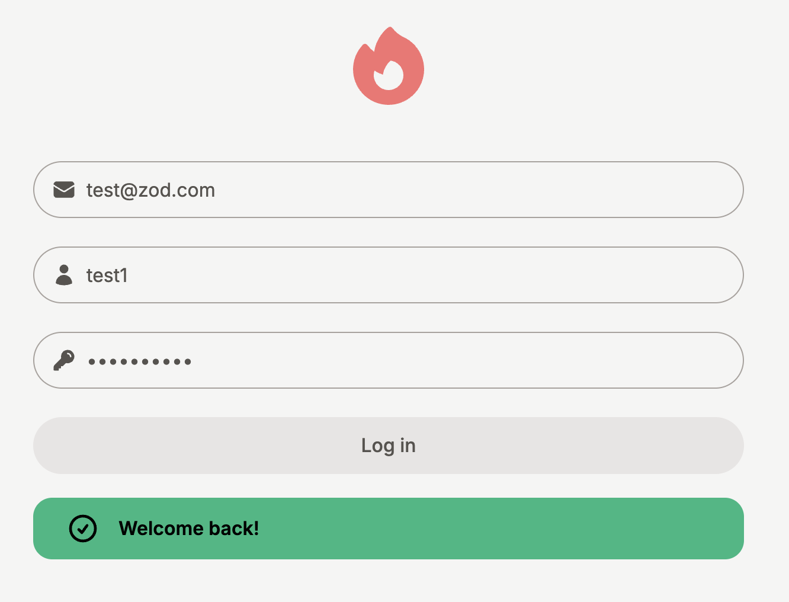

# Assignment #26

> Tailwind / Server Actions / useFormStatus / useFormState
> 유저의 비밀번호가 '12345' 라면, 성공 메시지를 보여야 하고 아닐 경우 에러 메시지를 보여야 합니다.

## 1. UI 설계

- Input 컴포넌트

  - 재사용성: Input 컴포넌트를 재사용 가능하도록 설계하고, name, placeholder, error, labelIcon 등의 props를 받도록 설정합니다.
  - 아이콘 배치:Input 컴포넌트 내부의 아이콘을 배치하기 위해 relative와 absolute를 사용합니다. top-1/2 left-4 -translate-y-1/2 클래스를 통해 아이콘이 input의 왼쪽 중앙에 배치되도록 설정합니다.
  - 에러 메시지 처리:error가 있을 때 input의 테두리를 border-red-500으로 설정하여 시각적으로 에러를 표현합니다. (error ? "border-red-500 focus:ring-red-400" : "border-stone-400 focus:ring-stone-300": 에러 메시지가 있을 경우에는 "border-red-500 focus:ring-red-400" 클래스 적용, 없을 경우에는 "border-stone-400 focus:ring-stone-300" 적용)

- Button 컴포넌트

  - 상태에 따른 스타일 변경: 버튼의 hover, active, disabled 상태에 따라 다른 스타일을 적용합니다. 예를 들어, 다음과 같이 각 상태별로 배경색을 변경할 수 있습니다.(hover:bg-stone-200, active:bg-stone-100, disabled:cursor-not-allowed disabled:text-stone-400 disabled:bg-stone-200)
  - formStatus가 Server Actions이 진행 중인 상태일 때는 disabled 속성을 활성화하여 버튼을 비활성화하고, 로딩 중이라는 텍스트를 표시합니다.

## 2. ServerActions

- Server Actions는 서버에서 실행되는 비동기 함수로, form 제출 및 데이터 변형을 처리할 수 있습니다. (공식문서 : [server actions and mutations, ](https://nextjs.org/docs/app/building-your-application/data-fetching/server-actions-and-mutations)[“use server”](https://ko.react.dev/reference/rsc/use-server))
- use server 지시어를 사용하여 Server Actions을 정의하고, 폼 데이터를 FormData로 전달받아 비밀번호 유효성 검증을 수행합니다. password 가 “12345”와 동일한지에 대한 유효성 검증을 진행하고 그에 대한 결과를 반환합니다. 요구사항에 동일하게 결과 값 반환 형식은 자유롭게 선택할 수 있습니다.

## 3. useFormStatus

- useFormStatus를 사용하여 폼 제출 상태를 추적하고, pending 프로퍼티를 사용하여 폼이 제출 중일 때(pending: true) 입력 요소와 버튼을 비활성화할 수 있습니다. (공식문서: [useFormStatus](https://ko.react.dev/reference/react-dom/hooks/useFormStatus))
- 주의 사항: useFormStatus는 반드시 <form> 태그 내부에서 사용해야 올바른 상태를 추적할 수 있습니다. 상위에 <form> 요소가 없다면 useFormStatus는 올바른 상태 정보를 반환하지 않습니다.

## 4. useFormState

- useFormState는 Server Actions로 처리된 폼의 상태를 클라이언트에 반영합니다. Server Actions의 실행 결과를 클라이언트 컴포넌트에서 동적으로 표현할 수 있습니다. (공식문서 : [Next.js-useFormState](https://nextjs.org/docs/app/building-your-application/data-fetching/server-actions-and-mutations#server-side-validation-and-error-handling))
- server actions에서 반환한 메시지를 클라이언트에서 보여줍니다. 비밀번호 유효성 검증이 실패한 경우(password가 12345가 아닌 경우) useFormState로 반환된 state에서 에러메시지를 추출하여 사용자에게 보여줍니다. 또한, form 의 모든 입력 항목의 유효성검증이 성공하는 경우 state에서 성공메시지를 추출하여 사용자에게 보여줍니다.

## 결론

이번 과제에서는 Next.js의 server actions과 useFormState, useFormStatus를 활용하여 폼 제출 상태 관리와 서버와의 상호작용을 구현하였습니다. 이를 통해 Tailwind CSS와 Next.js의 기능들을 조합하여, 클라이언트와 서버 간의 상호작용을 처리하는 방법을 학습할 수 있었습니다.

# Assignment #27

### Fail

### Success

# Zod를 활용한 유효성 검증 및 에러 처리

## 1. Zod를 활용한 유효성 검증

### 객체 스키마 생성

- `z.object`를 사용하여 로그인 폼의 스키마를 정의합니다.  
  [공식 문서: Object Schema](https://zod.dev/?id=objects)

### 문자열 유효성 검사

- 이메일, 유저명, 비밀번호에 대해 각각 `string` 관련 유효성 검사를 진행합니다.  
  [공식 문서: String](https://zod.dev/?id=strings)

#### 이메일 검증

- `email` 메서드: 이메일 형식 유효성 검사
- `refine` 메서드: `"@zod.com"`을 포함한 이메일만 통과  
  [공식 문서: Refine](https://zod.dev/?id=refine)

#### 유저명 검증

- `min` 메서드: 최소 5글자 이상이어야 통과

#### 비밀번호 검증

- `min` 메서드: 최소 10글자 이상
- `regex` 메서드: 숫자 최소 1개 포함

### 검증 로직

- `server actions`에서 `safeParse`를 사용하여 폼 데이터 검증
- 성공 시: 성공 메시지 반환
- 실패 시: 에러 처리  
  [공식 문서: safeParse](https://zod.dev/?id=safeparse)

## 2. 유효성 검증에 대한 에러 처리

### safeParse의 반환값

- 성공 시: `success: true`와 검증된 데이터 반환
- 실패 시: `success: false`와 에러 객체 반환

### 에러 메시지 단순화

- `error.flatten()`을 사용하여 에러 메시지를 단순화
- 클라이언트에서 접근 용이하게 구성  
  [공식 문서: Flatten Errors](https://zod.dev/?id=flattenerrors)

## 3. 에러 메시지 변경

### 에러 메시지 전달 방식

- 각 Input 항목에 전달하는 에러 메시지는 문자열 배열 형태로 변경
- `fieldErrors`에서 각 항목의 에러 메시지를 추출하여 사용자에게 표시

## 결론

이번 과제에서는 다음을 구현하고 학습하였습니다:

- Zod를 사용한 로그인 폼 유효성 검증
- `safeParse` 및 `flatten`을 통한 검증 결과 및 에러 메시지 처리
- Zod와 Tailwind CSS의 조합을 통해 간결하고 유지보수 쉬운 폼 검증 방식 구현

이를 통해 프론트엔드에서 안정적이고 효율적인 유효성 검증 시스템을 만들 수 있었습니다.
